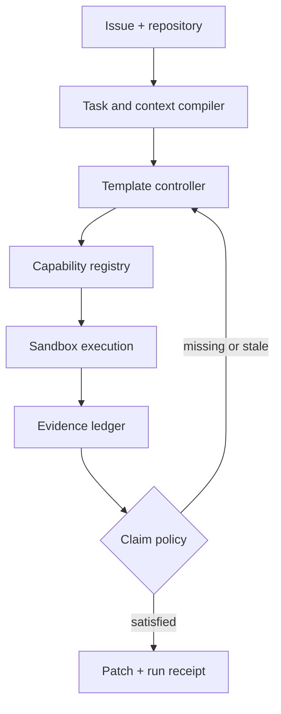

# Architecture

## Decision summary

V0 is a local, single-process TypeScript control plane with an append-only event
log and content-addressed artifacts. Model-directed commands run through a
sandbox adapter. Python is used only by reviewed language-specific helpers when
its AST/debugging ecosystem is materially better.

## Components

### Task compiler

Input:

- issue text and source identity;
- repository root, clean base tree hash, platform, language inventory;
- user authorization and host policy;
- Luna snapshot profile.

Output: versioned Task IR containing requested outcomes, constraints,
non-goals, task class, risk labels, observable acceptance conditions, evidence
requirements, and unresolved ambiguities.

Invariant: compilation never marks a user statement as observed fact.

### Context compiler

Input: Task IR, repository index, relevant files/symbols/tests/history, and
evidence records.

Output: ordered capsules. Every item contains a source locator, source hash,
selection reason, trust label, and token estimate. Capsule types are task,
structure, behavior, history, and verification.

Invariant: a capsule is a selection, not a completeness claim. Omitted-context
risk is recorded.

### Capability registry

Contains Tier 0 primitives and Tier 1 macros. A capability contract includes:

- stable name and semantic version;
- JSON input/output schemas;
- declared read/write/process/network effects;
- required executables and supported platforms;
- timeout/resource defaults;
- deterministic failure codes;
- implementation digest, fixtures, and provenance.

Invariant: capabilities cannot acquire permissions not present in their
contract and the run grant.

### Instrument compiler

Resolves an observation question to a capability or a small acyclic graph of
capabilities. V0 graphs have bounded nodes, no loops, explicit data edges, and
no model calls inside the graph. Generated source is an experimental feature
flag that is off by default.

Invariant: graph composition is permission-monotone and schema-valid.

### Controller

Selects one of five audited templates: direct, reproduce, CI failure, security
boundary, or compatibility. The controller may request a single additional
probe when a recorded hypothesis names a discriminating observation.

Invariant: escalation has a recorded trigger and cannot exceed run budgets.

### Evidence ledger

An append-only JSONL event stream stored outside model-directed write scope.
Each event includes the previous event hash. Artifacts are addressed by SHA-256.
Materialized task state is derived by deterministic replay.

Invariant: claims and evidence are distinct records. Evidence validity depends
on producer, artifact, dependency, environment, and time constraints.

### Claim policy and receipt

The Task IR declares required claim types. The policy maps each claim type to
acceptable evidence types and freshness dependencies. A run receipt lists
satisfied, unsupported, uncertain, waived, and impossible claims. Only the
trusted harness can set terminal status.

Invariant: `completed` means all mandatory claims are satisfied or explicitly
waived by authorized policy; it never means merely that a model said “done.”

## Data flow and state ownership

| Data | Writer | Reader | Trust |
|---|---|---|---|
| Task IR | trusted compiler | model/controller | trusted structure, untrusted source fields |
| Context capsule | compiler | Luna | integrity-protected selection |
| Capability graph | trusted resolver | sandbox adapter | validated but task-specific |
| Workspace | sandbox processes | capability runtime | untrusted mutable state |
| Raw execution capture | harness | evidence reducer | observed, integrity-protected |
| Evidence event log | harness only | reducer/receipt | trusted integrity, claim scope still limited |
| Model proposal | Luna | controller/patch applier | untrusted |
| Patch | scoped applier | verifier/user | untrusted until verified |
| Run receipt | trusted reducer | user/eval scorer | authoritative about recorded process, not absolute correctness |

## Failure modes

- Task compilation omits intent: receipt may be internally consistent but solve
  the wrong problem. Mitigation is requirement extraction scoring and user
  review for material ambiguity.
- Context compiler omits decisive code: Luna fails or patches superficially.
  Mitigation is source-addressed capsules and held-out retrieval ablations.
- Capability returns misleading data: evidence becomes invalid. Mitigation is
  negative controls, fixtures, producer versions, and raw capture.
- Sandbox unavailable: execution-dependent claims remain unsupported; Tier 3
  is refused.
- Event log corrupt: replay stops with deterministic integrity error; no receipt
  is issued as complete.
- Valid tests under-specify intent: requirement-specific claim stays uncertain.
- Luna ignores capability output: controller records non-use; profiler may
  change result shape or gate later actions only after ablation.

## Why this is not a “cognitive operating system”

The runtime has no claim to general cognition. It is a typed control plane for
a narrow software-engineering workflow. “Compiler” refers to validated
transformations between schemas. “Ledger” refers to an append-only hash-linked
record. No metaphor carries unstated technical meaning.

